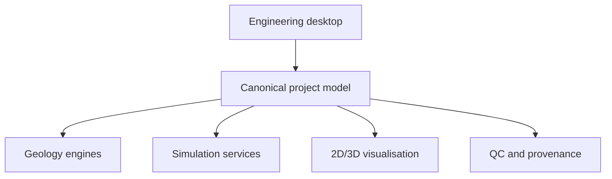

# Unified Subsurface Platform

A standalone engineering platform that brings Petrel-style geological modelling and ECLIPSE-style reservoir simulation workflows into one governed, extensible workspace.

> **Portfolio showcase:** This public repository documents verified architecture and implementation milestones. The full development source and proprietary project material are being reviewed before any code is released.

## Why this project exists

Conventional subsurface workflows often rely on disconnected applications, repeated file handoffs, and limited traceability between geological interpretations, simulation inputs, runs, and engineering decisions.

The platform is designed around one canonical project model with provenance, validation, revision history, and engine-neutral interfaces. Specialist open-source technologies operate behind adapters, allowing engineers to work through a consistent desktop environment.

## Core architecture

The canonical model—not an individual scientific engine—is the source of truth. Simulation models, cases, and executed runs are represented as separate governed objects. See the [architecture overview](docs/architecture.md) for details.

## Verified foundation

| Work package | Capability | Status |
| --- | --- | --- |
| WP-01 | Canonical model, immutable revisions, references, validation and SQLite persistence | Implemented and audited |
| WP-02 | Engine-service interfaces, capability discovery, jobs, cancellation and audit context | Implemented and audited |
| WP-03 | Desktop shell, commands, session persistence, global selection and job presentation | Implemented and audited |
| WP-04 | Neutral scenes, 2D/3D/cross-section views, picking, clipping and colour mapping | Implemented and audited |
| WP-05 | XTGeo-backed grid, property, surface and trajectory interchange | Implemented and qualified |
| WP-06 | GemPy and LoopStructural structural-modelling adapters | Implemented and qualified |

See [Verified implementation status](docs/verified-status.md) for scope and limitations.

## Technology stack

- **Reservoir simulation:** OPM Flow
- **Grid and subsurface data:** XTGeo
- **Structural modelling:** GemPy and LoopStructural
- **Visualisation:** VTK and PyVista
- **Desktop application:** Python and PySide6
- **Project metadata:** SQLite
- **Diagnostics and interoperability:** ResInsight and open industry formats
- **Packaging and runtime:** Docker

Additional technologies are evaluated only when they add a qualified capability; listing a candidate technology does not imply production integration.

## Design principles

- One canonical project instead of unmanaged file handoffs
- Exact provenance and reproducibility
- Clear separation between models, cases and simulation runs
- Scientific engines hidden behind stable adapters
- Automatic validation and stale-dependency propagation
- Engineer-facing workflows familiar to Petrel/ECLIPSE users
- Local-first execution with a path to managed compute
- Open interoperability and replaceable engines

## Product direction

The longer-term roadmap includes geological interpretation, grid construction and QC, wells and petrophysics, facies and property modelling, upscaling, simulation model building, results analysis, diagnostics, case comparison, connectivity, development scenarios, ensembles, uncertainty, history matching, seismic workflows, search, automation and plugin extensions.

These roadmap items are **not presented as completed features** unless they appear in the verified-status record.

## Public-release policy

This repository intentionally excludes:

- Company-confidential source code and documents
- Proprietary or field-identifying datasets
- Credentials, machine-specific configuration and local paths
- Licensed Petrel or ECLIPSE components
- Unreviewed claims or incomplete research experiments

A sanitized technical demonstration and selected source modules will be added after review.

## Author

**Edward Obinna Nkwegu**  
Petroleum Engineering, China University of Petroleum–Beijing

[LinkedIn](https://www.linkedin.com/in/edward-nkwegu-1b60ba31b) · [GitHub Profile](https://github.com/nkweguedward1-prog)
