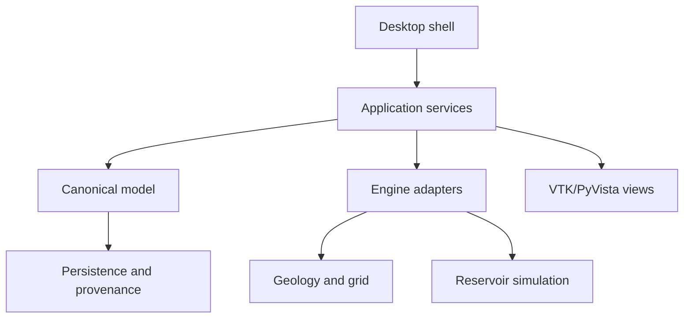

# Architecture

## Architectural intent

The Unified Subsurface Platform is organized around a canonical domain model. External scientific tools are computation providers rather than owners of project state.

## Canonical project model

The canonical layer records engineering objects, revisions, units, coordinate reference systems, validation results, dependencies and provenance. Large numerical arrays are referenced with metadata such as checksum, shape, data type, units and revision ownership.

This avoids making an engine-specific file the only source of truth.

## Engine adapters

Scientific engines are accessed through stable interfaces. Each adapter declares its capabilities and converts between canonical objects and engine-native representations.

This design supports:

- Replaceable scientific engines
- Consistent validation and error handling
- Reproducible job execution
- Clear records of which engine and runtime produced an output
- Testing with controlled mock adapters

## Simulation object separation

The architecture distinguishes:

1. **Simulation model** — governed engineering inputs
2. **Case** — a configured scenario derived from a model
3. **Run** — a specific execution with runtime identity and outputs

This prevents results from being detached from the exact inputs and environment that created them.

## Visualisation

The visualisation layer uses neutral scene and layer objects rather than coupling the desktop directly to one data engine. VTK and PyVista provide rendering, while application-level validation controls transforms, ranges, picking and resource lifecycle.

## Product boundary

Petrel, ECLIPSE and similar commercial products inform familiar engineering workflows, but their licensed code and interfaces are not redistributed. OPM Flow, XTGeo, GemPy, LoopStructural, VTK and PyVista are integrated or evaluated according to their own licences and qualification status.
